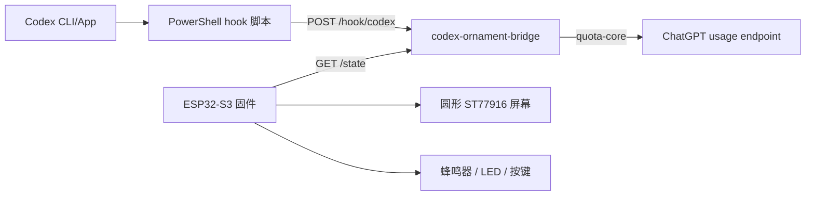

# Codex 额度组件与 ESP32 桌面摆件

这个项目包含两部分：

1. Windows/Tauri 桌面额度组件：读取本机 Codex 登录凭据，显示 Codex 用量。
2. ESP32-S3 桌面摆件集成：在圆形 ST77916 屏幕上显示 Codex 额度和任务完成提醒。

新增的桌面摆件方案分为 PC 端桥接服务和 ESP32 固件。Codex 凭据只保存在 PC 上，ESP32 只读取局域网内的展示用 JSON，不保存 token。

## 完成情况检查

| 任务 | 状态 | 证据 |
| --- | --- | --- |
| 通过本地端口接收 Codex 任务完成 hook | 已完成 | `crates/codex-ornament-bridge`、`scripts/codex-ornament-hook.ps1` |
| ESP32 程序框架与手动部署文档 | 已完成 | `firmware/esp32-ornament`、`docs/software-development-guide.md` |

## 架构



## 目录结构

```text
crates/quota-core
  共享的 Codex 额度读取逻辑。

crates/codex-ornament-bridge
  PC 本地 HTTP 桥接服务，负责接收 Codex hook、读取额度快照、向 ESP32 提供状态。

scripts/codex-ornament-hook.ps1
  Codex notify 和 lifecycle hooks 的 PowerShell 转发脚本。

firmware/esp32-ornament
  ESP32-S3 的 ESP-IDF 固件框架。

docs/software-engineering
  需求、架构、接口、测试、部署、风险和追踪矩阵等工程文档。

docs/software-development-guide.md
  软件开发指导书和代码审查命令。
```

## 额度数据来源

额度读取复用现有的 `quota-core` 实现，请求地址为：

```text
https://chatgpt.com/backend-api/wham/usage
```

默认读取本机 Codex 登录凭据：

```text
%USERPROFILE%\.codex\auth.json
```

如果设置了 `CODEX_HOME`，则读取：

```text
%CODEX_HOME%\auth.json
```

PC 端会向 `chatgpt.com` 发送 `Authorization: Bearer <access_token>` 和 `ChatGPT-Account-Id`。这些凭据不会发送给 ESP32。

## PC 桥接服务

桥接服务提供以下接口：

```text
GET  /health       健康检查
GET  /quota        当前 Codex 额度快照
GET  /state        给 ESP32 使用的任务 + 额度状态
POST /hook/codex   Codex hook 事件接收接口
POST /event        /hook/codex 的别名
```

默认监听地址：

```text
http://0.0.0.0:8787
```

开发运行：

```powershell
cd D:\Desktop\codex\codex-quota-widget
cargo run -p codex-ornament-bridge
```

手动构建 release：

```powershell
cargo build -p codex-ornament-bridge --release
.\target\release\codex-ornament-bridge.exe
```

可选环境变量：

```powershell
$env:CODEX_ORNAMENT_BIND = "0.0.0.0:8787"
$env:CODEX_ORNAMENT_ENDPOINT = "http://127.0.0.1:8787/hook/codex"
$env:CODEX_ORNAMENT_TOKEN = "change-this-if-lan-post-is-needed"
```

安全规则：

- 来自本机 loopback 的 `POST` 请求可以不带 token。
- 来自局域网的 `POST` 请求默认会被拒绝。
- 如果确实需要允许局域网写入事件，设置 `CODEX_ORNAMENT_TOKEN`，并在请求头中带上 `X-Codex-Ornament-Token`。
- ESP32 正常只需要访问 `GET /state`。

## Codex Hook 配置

把下面配置加入：

```text
%USERPROFILE%\.codex\config.toml
```

```toml
notify = [
  "powershell.exe",
  "-NoProfile",
  "-ExecutionPolicy",
  "Bypass",
  "-File",
  "D:\\Desktop\\codex\\codex-quota-widget\\scripts\\codex-ornament-hook.ps1"
]
```

`notify` 会把单个 JSON 字符串作为命令行参数传给脚本，脚本会转发到本机 `POST /hook/codex`。

可选 lifecycle hooks 文件：

```text
%USERPROFILE%\.codex\hooks.json
```

```json
{
  "hooks": {
    "UserPromptSubmit": [
      {
        "hooks": [
          {
            "type": "command",
            "command": "powershell.exe -NoProfile -ExecutionPolicy Bypass -File \"D:\\Desktop\\codex\\codex-quota-widget\\scripts\\codex-ornament-hook.ps1\""
          }
        ]
      }
    ],
    "Stop": [
      {
        "hooks": [
          {
            "type": "command",
            "command": "powershell.exe -NoProfile -ExecutionPolicy Bypass -File \"D:\\Desktop\\codex\\codex-quota-widget\\scripts\\codex-ornament-hook.ps1\""
          }
        ]
      }
    ]
  }
}
```

生命周期 hook 会从 stdin 传入 JSON。配置后在 Codex 中运行 `/hooks`，信任这条 PowerShell 命令，否则 Codex 不会运行未信任的 hook。

状态映射：

| Codex 事件 | 摆件状态 |
| --- | --- |
| `agent-turn-complete` | `done` |
| `UserPromptSubmit` | `running` |
| `Stop` | `done` |
| 非法 JSON | `error` |

## ESP32 固件

目标硬件：

```text
主控：ESP32-S3-N16R8
屏幕：1.5 寸圆形 ST77916 TFT，360x360，QSPI，16P FPC
数据源：GET http://<PC-LAN-IP>:8787/state
```

手动 ESP-IDF 部署：

```powershell
cd D:\Desktop\codex\codex-quota-widget\firmware\esp32-ornament
idf.py set-target esp32s3
idf.py menuconfig
idf.py build
idf.py -p COMx flash monitor
```

你买的 ESP32-S3-N16R8 带 8MB PSRAM，HUD 使用全屏 RGB565 缓冲，建议在 `menuconfig` 里启用 PSRAM：

```text
Component config -> ESP PSRAM -> Support for external, SPI-connected RAM
```

`menuconfig` 配置入口：

```text
Codex Ornament
```

需要配置：

- Wi-Fi SSID。
- Wi-Fi 密码。
- PC bridge 的 `/state` URL。
- ST77916 驱动默认是 `st77916_qspi`，对应你买的 360x360 QSPI 圆屏。
- GPIO 默认映射已按当前购买型号给出，但烧录前仍要核对转接板标注。

固件使用 Espressif 官方 `esp_lcd_st77916` 组件，并预留了 SPI/QSPI 初始化路径。项目没有手写 ST77916 初始化命令表。

默认屏幕接线建议：

| 屏幕 16P 符号 | ESP32-S3 |
| --- | --- |
| VCC | 3V3 |
| IOVCC | 3V3 |
| GND / 14-16 GND | GND |
| SCL | GPIO12 |
| CS | GPIO10 |
| RESET | GPIO8 |
| IO0 | GPIO11 |
| IO1 | GPIO13 |
| IO2 | GPIO14 |
| IO3 | GPIO15 |
| TE | 初版不接 |
| A | 背光阳极，走屏幕/转接板限流路径接 3V3 |
| K | 背光阴极，建议通过 MOSFET 由 GPIO7 控制，或在确认限流后接 GND 常亮 |

注意：不要直接用 GPIO 给背光供电，除非确认转接板有限流且电流安全。

## 屏幕 UI

屏幕渲染已从日志占位升级为实际圆屏 HUD 页面，风格参考你上传的黑底蓝绿像素仪表盘。

当前页面包含：

- 黑色圆形背景。
- 蓝色外圈刻度和分隔线。
- 像素风 `CODEX` 标题。
- `CURRENT` 当前额度行：青色百分比、分段进度条、重置时间。
- `WEEKLY` 周额度行：绿色百分比、分段进度条、重置时间。
- 底部 hook 状态：`IDLE`、`AGENT ACTIVE`、`TASK DONE`、`HOOK ERROR`。
- 任务完成时显示绿色圆环和中央 `DONE` 覆盖提醒。

实现文件：

```text
firmware/esp32-ornament/main/display.c
```

实现方式：

- 使用 RGB565 内存画布。
- 用 `esp_lcd_panel_draw_bitmap()` 刷屏。
- 不引入 LVGL，避免小屏摆件依赖过重。

## 手机热点配网

固件支持用手机手动配网，不需要先把 Wi-Fi 写死在固件里。

启动逻辑：

1. ESP32 从 NVS 读取已保存的 Wi-Fi 和 bridge URL。
2. 如果没有保存 Wi-Fi，自动启动配网热点。
3. 如果保存的 Wi-Fi 连接失败，也会启动配网热点。
4. 手机提交配置后，ESP32 保存到 NVS 并自动重启。

默认配网热点：

```text
SSID：Codex-Ornament-xxxx
密码：codex1234
配置地址：http://192.168.4.1
```

手机操作：

1. 给 ESP32 摆件上电。
2. 如果屏幕或串口提示进入 setup/provisioning 模式，用手机连接 `Codex-Ornament-xxxx`。
3. 浏览器打开 `http://192.168.4.1`。
4. 在页面里选择扫描到的家庭/办公室 Wi-Fi SSID。
5. 只填写 Wi-Fi 密码和 PC bridge 的 `/state` 地址。
6. 如果列表没有目标 Wi-Fi，点击 `Rescan Wi-Fi` 重新扫描；只有扫描失败时才会显示手动 SSID 输入框。
7. 点击保存，ESP32 会重启并连接到正常 Wi-Fi。

Bridge URL 示例：

```text
http://192.168.1.23:8787/state
```

配网相关源码：

```text
firmware/esp32-ornament/main/config_portal.c
firmware/esp32-ornament/main/settings.c
firmware/esp32-ornament/main/wifi.c
```

这部分参考 ESP-IDF 官方 SoftAP、HTTP server 和 Wi-Fi station 示例实现。
配网页面使用 APSTA 模式，手机保持连接 ESP32 热点的同时，ESP32 会扫描附近路由器并生成 SSID 下拉列表。

## 手动烟测

先启动 bridge，然后执行：

```powershell
Invoke-RestMethod http://127.0.0.1:8787/health

Invoke-RestMethod `
  -Method Post `
  -Uri http://127.0.0.1:8787/hook/codex `
  -ContentType application/json `
  -Body '{"hook_event_name":"Stop","message":"manual smoke test"}'

Invoke-RestMethod http://127.0.0.1:8787/state
```

预期结果：

- `/health` 返回 `ok`。
- `/hook/codex` 返回 `{"ok":true,...}`。
- `/state` 中包含 `status: "done"` 和额度快照。

## 代码审查命令

只使用本地已有工具，不自动安装环境。

```powershell
cargo fmt --check -p codex-ornament-bridge -p quota-core
cargo check -p codex-ornament-bridge
cargo test -p codex-ornament-bridge
cargo test -p quota-core
cargo clippy -p codex-ornament-bridge -- -D warnings
cargo clippy -p quota-core -- -D warnings
```

最近一次本地审查结果：

```text
以上命令全部通过。
codex-ornament-bridge：7 个测试通过。
quota-core：7 个测试通过。
```

ESP-IDF 构建未执行，因为当前 shell 找不到 `idf.py`，并且本项目按要求把工具链安装留给手动部署。

## 原有 Tauri 桌面组件

原有桌面额度组件仍可使用。

开发运行：

```powershell
npm install
npm run tauri:dev
```

构建安装包：

```powershell
npm run tauri:build
```

安装包输出位置：

```text
src-tauri\target\release\bundle\nsis\
```

## 工程文档

建议从这些文件开始看：

- `docs/software-development-guide.md`
- `docs/software-engineering/00-plan.md`
- `docs/software-engineering/01-requirements.md`
- `docs/software-engineering/02-architecture.md`
- `docs/software-engineering/03-api-contract.md`
- `docs/software-engineering/06-test-plan.md`
- `docs/software-engineering/07-deployment.md`
- `docs/software-engineering/11-hardware-software-interface.md`

## 硬件注意事项

烧录显示相关代码前，必须向卖家确认：

- 屏幕确认为 360x360。
- 接口确认为 QSPI。
- 16P FPC 引脚表与上面的 K/A/GND/CS/SCL/RESET/IO3/IO2/IO1/IO0/TE/VCC/IOVCC/GND 一致。
- 逻辑电压和背光电压。
- 转接板是否带背光限流。

在确认屏幕引脚前，不要假定 README 或 Kconfig 里的候选 GPIO 映射一定安全。

## 参考来源

- Codex hooks：`https://developers.openai.com/codex/hooks`
- Codex advanced config 与 notify：`https://developers.openai.com/codex/config-advanced`
- Espressif ST77916 组件：`https://components.espressif.com/components/espressif/esp_lcd_st77916`
- Espressif ST77916 GitHub 源码：`https://github.com/espressif/esp-iot-solution/tree/master/components/display/lcd/esp_lcd_st77916`
- ESP-IDF Wi-Fi station 示例：`https://github.com/espressif/esp-idf/tree/master/examples/wifi/getting_started/station`
- ESP-IDF SoftAP 示例：`https://github.com/espressif/esp-idf/tree/master/examples/wifi/getting_started/softAP`
- ESP-IDF HTTP client 示例：`https://github.com/espressif/esp-idf/tree/master/examples/protocols/esp_http_client`
- ESP-IDF HTTP server 示例：`https://github.com/espressif/esp-idf/tree/master/examples/protocols/http_server/simple`
