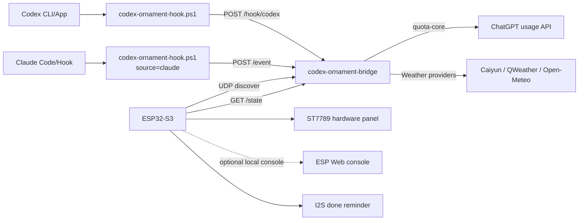

# Codex Ornament

这是一个本地 Codex/Claude 任务与 Codex 额度显示项目，包含三部分：

1. Windows/Tauri 桌面额度组件。
2. PC 端 `codex-ornament-bridge` 网桥服务。
3. ESP32-S3 桌面摆件固件，驱动 240x240 ST7789 屏幕、桥接状态页和本地 I2S 任务完成提示音。

Codex 登录凭据只保存在 PC 上。ESP32 只读取局域网内的展示 JSON，不保存 token。

## 当前状态

- PC 网桥接收 Codex/Claude hook，维护多生产者、多消费者场景下的任务状态。
- Web 面板并列显示 Codex Task 和 Claude Task。
- ESP 硬件屏幕保持合并任务视图，不区分 Codex/Claude。
- 网桥每 1 分钟检查额度缓存，网络异常时保留旧数据，不用 `--` 覆盖有效数据。
- ESP 支持 UDP 自动发现网桥，PC IP 变化后可自动保存新的 `/state` 地址。
- ESP 默认通过 UDP 自动发现 PC 网桥；板端 Web 控制台和 mDNS 默认关闭，需要调试时可在 Kconfig 中开启。
- 空闲 1 分钟进入待机时钟页，显示壁纸、时间、日期、天气、Wi-Fi 信号和 reset 时间。
- 所有任务完成时闪烁 done 5 秒；若仍有任务运行，保持 running 且不播放完成语音。
- 连续桥接失败达到阈值后才显示 `Bridge offline`，短暂失败继续显示上一帧有效状态。
- 任务完成提示默认使用屏幕 done 闪烁；启用 Web 控制台后可调节本地 I2S 提示音音量。
- 小智页面显示实时 STT/TTS、激活码和错误状态，不再使用固定示例对话占位。
- ESP32 固件默认采用 bridge-first 瘦身配置，关闭板端 Web 控制台、配网页和本地天气客户端以降低 flash/RAM 压力，需要时可在 Kconfig 中重新开启。
- 固件保留可选 ST77916 SPI/QSPI 点屏诊断支持，默认关闭，默认硬件仍是 ST7789 SPI。
- 页面切换和小智启停由 GPIO 按键、Web/bridge 控制完成；外部 UART 语音模块不再随固件构建。

## 架构



## 目录

```text
crates/quota-core
  共享的 Codex 额度读取逻辑。

crates/codex-ornament-bridge
  PC 本地 HTTP 网桥。接收 hook、聚合任务、读取额度和天气，向 ESP32 提供状态。

scripts/codex-ornament-hook.ps1
  Codex/Claude hook 转发脚本。

scripts/start-codex-ornament-bridge.ps1
  Windows 启动脚本。会加载 .env/.env.local，自动选择可用 LAN IP，并启动网桥。

firmware/esp32-ornament
  ESP32-S3 ESP-IDF 固件。

src / src-tauri
  原有 Tauri 桌面额度组件。

docs
  工程文档、问题记录和部署说明。
```

## PC 网桥

默认监听：

```text
http://0.0.0.0:8787
```

接口：

```text
GET  /health       健康检查，返回 ok
GET  /discover     返回 LAN IP、/state 和 /health URL
GET  /quota        当前额度快照
GET  /state        ESP/Web 使用的任务、额度、天气状态
POST /hook/codex   hook 事件入口
POST /event        /hook/codex 的别名
OPTIONS *          CORS/私有网络预检
```

开发运行：

```powershell
cd D:\Desktop\codex\codex-quota-widget
cargo run -p codex-ornament-bridge
```

构建并后台启动：

```powershell
cd D:\Desktop\codex\codex-quota-widget
cargo build -p codex-ornament-bridge
powershell -NoProfile -ExecutionPolicy Bypass -File .\scripts\start-codex-ornament-bridge.ps1
```

启动脚本会：

- 读取 `.env` 和 `.env.local`。
- 默认设置北京海淀天气坐标。
- 自动选择真实 LAN IP，过滤 loopback、link-local、`198.18.0.0/15`、Meta/Clash/VMware/WSL/蓝牙等接口。
- 如果 `target\debug\codex-ornament-bridge.exe` 不存在，自动执行 `cargo build -p codex-ornament-bridge`。
- 已有网桥进程时不重复启动。

## 网桥配置

常用环境变量：

```powershell
$env:CODEX_ORNAMENT_BIND = "0.0.0.0:8787"
$env:CODEX_ORNAMENT_ENDPOINT = "http://127.0.0.1:8787/hook/codex"
$env:CODEX_ORNAMENT_TOKEN = "change-this-if-lan-post-is-needed"
$env:CODEX_ORNAMENT_SOURCE = "codex"
$env:CODEX_ORNAMENT_SESSION_ID = "<optional-session-id>"
$env:CODEX_ORNAMENT_LAN_IP = "192.168.1.107"
```

天气配置：

```powershell
$env:CODEX_ORNAMENT_WEATHER_PROVIDER = "auto"       # auto | openmeteo | qweather | caiyun
$env:CODEX_ORNAMENT_WEATHER_LAT = "39.99540087499999"
$env:CODEX_ORNAMENT_WEATHER_LON = "116.34162524999999"
$env:CODEX_ORNAMENT_WEATHER_LABEL = "HAIDIAN"
$env:CODEX_ORNAMENT_QWEATHER_HOST = "<qweather-api-host>"
$env:CODEX_ORNAMENT_QWEATHER_TOKEN = "<token>"
$env:CODEX_ORNAMENT_CAIYUN_TOKEN = "replace-with-your-token"
```

默认天气策略是 `auto`：优先尝试可用的 Caiyun/QWeather，再退回 Open-Meteo。请求失败时网桥保留旧天气数据，直到拿到新的有效数据。

安全规则：

- 来自本机 loopback 的 `POST` 可以不带 token。
- 来自局域网的 `POST` 默认拒绝。
- 如果需要允许局域网写入事件，设置 `CODEX_ORNAMENT_TOKEN`，请求头带 `X-Codex-Ornament-Token`。
- ESP32 正常只需要 `GET /state`，不需要写入权限。

## 任务状态模型

网桥使用生产者/消费者模式处理 task event：

- HTTP hook 请求作为生产者，把事件放入有界队列。
- 单独消费者串行更新内存状态，避免多请求并发修改 active/done 状态。
- 队列容量为 64，hook 请求会等待短时间确认；队列满时返回 503。
- 任务身份优先使用 `source + turn_id`，其次使用 `source + session_id`，匿名任务使用递增 ID。
- Codex 和 Claude 使用独立 source，互不闭合对方任务。
- `source` 可用 `codex`、`claude` 或 `claudecode`。未提供时默认按 Codex 处理。
- Claude hook payload 中带 `.claude` transcript path 时会自动按 Claude 处理，并派生稳定 `turn_id` 复用同一套任务身份规则。
- `sourceTasks.codex` 和 `sourceTasks.claude` 分别给 Web 面板显示。
- 顶层 `activeTaskCount` 和 `status` 给 ESP 硬件屏幕使用，保持合并任务视图。
- 对 Codex session 日志会做最近任务恢复，用于处理上下文压缩、进程重启或 hook stop 丢失导致的 orphaned active task。

done 提醒规则：

- `doneSeq` 增加且 active task 数量从非零降到 0 时，ESP 才播报任务完成。
- 若 `doneSeq` 增加但仍有 active task，固件会抑制语音和 done 闪烁，避免任务还在运行时误响。
- Codex 和 Claude 在 5 秒窗口内都完成时，Web 状态可合并显示为 `Claude + Codex done`。

## Hook 配置

Codex notify 配置，写入：

```text
%USERPROFILE%\.codex\config.toml
```

```toml
notify = [
  "powershell.exe",
  "-NoProfile",
  "-ExecutionPolicy",
  "Bypass",
  "-File",
  "D:\\Desktop\\codex\\codex-quota-widget\\scripts\\codex-ornament-hook.ps1"
]
```

Codex lifecycle hooks，可选写入：

```text
%USERPROFILE%\.codex\hooks.json
```

```json
{
  "hooks": {
    "UserPromptSubmit": [
      {
        "hooks": [
          {
            "type": "command",
            "command": "powershell.exe -NoProfile -ExecutionPolicy Bypass -File \"D:\\Desktop\\codex\\codex-quota-widget\\scripts\\codex-ornament-hook.ps1\""
          }
        ]
      }
    ],
    "Stop": [
      {
        "hooks": [
          {
            "type": "command",
            "command": "powershell.exe -NoProfile -ExecutionPolicy Bypass -File \"D:\\Desktop\\codex\\codex-quota-widget\\scripts\\codex-ornament-hook.ps1\""
          }
        ]
      }
    ]
  }
}
```

Claude 侧复用同一个脚本时，把环境变量设为：

```powershell
$env:CODEX_ORNAMENT_SOURCE = "claude"
$env:CODEX_ORNAMENT_ENDPOINT = "http://127.0.0.1:8787/event"
```

hook 脚本会补齐 `session_id`、`cwd`、`source` 等上下文。非法 JSON 会被网桥作为 HTTP 400 拒绝，不进入任务状态机。

## 额度数据

额度读取复用 `quota-core`，请求：

```text
https://chatgpt.com/backend-api/wham/usage
```

凭据来源：

```text
%USERPROFILE%\.codex\auth.json
```

如果设置了 `CODEX_HOME`，则读取：

```text
%CODEX_HOME%\auth.json
```

网桥会向 ChatGPT usage API 发送 `Authorization: Bearer <access_token>` 和 `ChatGPT-Account-Id`。这些凭据不会发送给 ESP32。

刷新策略：

- 网桥启动后每 1 分钟检查一次额度。
- 缓存未过期或已有刷新线程运行时，不重复请求。
- `/state` 不阻塞等待慢请求。
- reset 时间没过期时保留旧 reset 时间。
- 网络错误或认证错误不会把已有有效数据改成 `--`。

## ESP32 固件

目标硬件：

```text
主控：ESP32-S3-N16R8
屏幕：1.54 寸 ST7789 SPI，240x240
音频：MAX98357A I2S 本地提示音
数据源：GET http://<PC-LAN-IP>:8787/state
```

固件不再包含外部 UART 语音模块工程、任务完成 UART 触发或 UART 语音命令入口。

构建和烧录：

```cmd
cd D:\Desktop\codex\codex-quota-widget\firmware\esp32-ornament
call D:\Espressif\frameworks\esp-idf-v5.4.1\export.bat
set IDF_CCACHE_ENABLE=0
idf.py set-target esp32s3
idf.py build
idf.py -p COM5 flash
```

`menuconfig` 入口：

```text
Codex Ornament
```

关键 Kconfig：

```text
ORNAMENT_WIFI_SSID
ORNAMENT_WIFI_PASSWORD
ORNAMENT_BRIDGE_URL
ORNAMENT_BRIDGE_AUTO_MATCH_ON_BOOT
ORNAMENT_BRIDGE_AUTO_MATCH_RETRY_MS
ORNAMENT_BRIDGE_OFFLINE_FAILURES
ORNAMENT_HOSTNAME_PREFIX
ORNAMENT_MDNS_ENABLED
ORNAMENT_POLL_INTERVAL_MS
ORNAMENT_DONE_FLASH_MS
ORNAMENT_STANDBY_CLOCK_MS
ORNAMENT_AUDIO_VOLUME_PERCENT
ORNAMENT_XIAOZHI_TRANSPORT_BRIDGE
ORNAMENT_ST77916_DISPLAY_ENABLED
ORNAMENT_LCD_BOOT_TEST_MS
ORNAMENT_LCD_REFERENCE_TEST_ONLY
```

默认屏幕接线：

| 屏幕信号 | ESP32-S3 |
| --- | --- |
| GND | GND |
| VCC | 3V3 |
| SCL/SCLK | GPIO12 |
| SDA/MOSI | GPIO11 |
| CS | GPIO10 |
| DC | GPIO13 |
| RES/RST | GPIO8 |
| BLK | GPIO7 |

注意：不要直接用 GPIO 给背光供电，除非确认转接板有限流且电流安全。

## ESP 屏幕

屏幕渲染使用 RGB565 画布和 `esp_lcd_panel_draw_bitmap()`，不引入 LVGL。

硬件屏幕当前显示：

- `CURRENT` 当前额度和 `WEEKLY` 周额度。
- current/weekly reset time。
- 合并任务状态：idle、running、done、error。
- active task 总数和 done seq。
- 多任务运行时持续 running 跑马灯。
- 所有任务完成时 done 闪烁 5 秒；部分任务完成但仍有任务运行时继续 running。
- 空闲 1 分钟后进入待机页。
- 待机页显示壁纸、时间、日期、天气图标、温度、reset 时间和扇形 Wi-Fi 信号图标。
- 桥接短暂失败时保留上一帧有效状态；冷启动且无有效快照时才显示错误页。

相关实现：

```text
firmware/esp32-ornament/main/app_main.c
firmware/esp32-ornament/main/display.c
firmware/esp32-ornament/main/display_core.c
firmware/esp32-ornament/main/ornament_state.c
firmware/esp32-ornament/main/standby_wallpaper.h
```

## ESP Web 控制台

默认 bridge-first 固件关闭板端 Web 控制台。需要本地调试时，在 `menuconfig` 中开启
`CONFIG_ORNAMENT_WEB_CONSOLE_ENABLED`，如需 `.local` 访问再开启 `CONFIG_ORNAMENT_MDNS_ENABLED`。
开启后控制台地址形如：

```text
http://codex-ornament-4ad4.local/
http://<device-ip>/
```

页面包含：

- Local URL 和当前 Bridge URL。
- Wi-Fi、时间、天气、额度概览。
- Codex Task 和 Claude Task 并列状态。
- Codex/Claude session_id、turn_id 明细。
- IP、Gateway、Channel、BSSID、断连原因。
- Bridge Debug：last fetch、连续失败数、last success/failure、auto-match 结果。
- Voice Volume 滑块和 Test Voice。
- Test Bridge URL、Save Bridge URL、Auto Match This PC Bridge。
- JSON Status、Reboot、Clear Wi-Fi and Bridge Config。

JSON 状态接口：

```text
GET /status
```

关键字段包括：

```json
{
  "fetch_error": "ESP_OK",
  "bridge_debug": {
    "last_fetch_error": "ESP_OK",
    "consecutive_fetch_failures": 0,
    "last_auto_match_ok": false
  }
}
```

## 手机热点配网

默认 bridge-first 固件关闭 SoftAP 配网页。需要手机手动配网时，在 `menuconfig` 中开启
`CONFIG_ORNAMENT_CONFIG_PORTAL_ENABLED`；否则请通过 `menuconfig`、NVS 或已有配置提供 Wi-Fi 和 Bridge URL。

启用配网页后的启动逻辑：

1. ESP32 从 NVS 读取已保存的 Wi-Fi 和 bridge URL。
2. 如果没有保存 Wi-Fi，启动配网热点。
3. 如果保存的 Wi-Fi 连接失败，也会启动配网热点。
4. 手机提交配置后，ESP32 保存到 NVS 并自动重启。

启用配网页后的默认热点：

```text
SSID：Codex-Ornament-xxxx
密码：codex1234
配置地址：http://192.168.4.1
```

手机操作：

1. 给 ESP32 上电。
2. 如果屏幕或串口提示进入 setup/provisioning 模式，用手机连接 `Codex-Ornament-xxxx`。
3. 浏览器打开 `http://192.168.4.1`。
4. 选择扫描到的 Wi-Fi SSID。
5. 填 Wi-Fi 密码和 PC bridge 的 `/state` 地址。
6. 如果列表没有目标 Wi-Fi，点击 `Rescan Wi-Fi`。
7. 点击保存，ESP32 重启并连接正常 Wi-Fi。

Bridge URL 示例：

```text
http://192.168.1.107:8787/state
```

配网相关源码：

```text
firmware/esp32-ornament/main/config_portal.c
firmware/esp32-ornament/main/settings.c
firmware/esp32-ornament/main/wifi.c
```

## 自动发现和 mDNS

PC 网桥监听 UDP `8787`。ESP 发送：

```text
codex-ornament-discover-v1
```

网桥返回：

```json
{
  "service": "codex-ornament-bridge",
  "localIp": "192.168.1.107",
  "stateUrl": "http://192.168.1.107:8787/state",
  "healthUrl": "http://192.168.1.107:8787/health"
}
```

ESP 校验 `/state` 成功后会保存 URL。轮询失败时，固件按 `ORNAMENT_BRIDGE_AUTO_MATCH_RETRY_MS` 周期重试发现。

如果开启 Clash Verge Rev / Mihomo TUN 后 `.local` 访问异常，优先检查：

- mDNS 是否能解析到当前设备 IP。
- 当前设备 IP 是否变了。
- TUN 是否拦截了局域网 HTTP。

规则层的 `DOMAIN-SUFFIX,local,DIRECT` 不一定能解决 TUN 路由截获。更稳妥的是在 TUN 路由层排除局域网网段，或在路由器给 ESP MAC 做 DHCP 静态绑定。

## 手动烟测

启动 PC 网桥：

```powershell
cd D:\Desktop\codex\codex-quota-widget
powershell -NoProfile -ExecutionPolicy Bypass -File .\scripts\start-codex-ornament-bridge.ps1
```

检查网桥：

```powershell
Invoke-RestMethod http://127.0.0.1:8787/health
Invoke-RestMethod http://127.0.0.1:8787/discover
Invoke-RestMethod http://127.0.0.1:8787/state
```

模拟任务：

```powershell
Invoke-RestMethod `
  -Method Post `
  -Uri http://127.0.0.1:8787/hook/codex `
  -ContentType application/json `
  -Body '{"hook_event_name":"UserPromptSubmit","session_id":"manual","turn_id":"manual-1","prompt":"manual smoke"}'

Invoke-RestMethod `
  -Method Post `
  -Uri http://127.0.0.1:8787/hook/codex `
  -ContentType application/json `
  -Body '{"hook_event_name":"Stop","session_id":"manual","turn_id":"manual-1","message":"manual done"}'
```

检查 ESP：

```powershell
curl.exe --max-time 5 http://codex-ornament-4ad4.local/status
curl.exe --max-time 5 http://<device-ip>/status
```

最近一次硬件验证：

```text
2026-06-03
idf.py -p COM5 flash 成功。
ESP32-S3 MAC：e0:72:a1:d3:4a:d4。
mDNS 状态页可访问。
/status 显示 Wi-Fi connected、fetch_error=ESP_OK、bridge_debug.consecutive_fetch_failures=0。
```

## 本地检查命令

Rust：

```powershell
cargo fmt --check -p codex-ornament-bridge -p quota-core
cargo check -p codex-ornament-bridge
cargo test -p codex-ornament-bridge
cargo test -p quota-core
cargo clippy -p codex-ornament-bridge -- -D warnings
cargo clippy -p quota-core -- -D warnings
```

ESP-IDF：

```cmd
cd D:\Desktop\codex\codex-quota-widget\firmware\esp32-ornament
call D:\Espressif\frameworks\esp-idf-v5.4.1\export.bat
set IDF_CCACHE_ENABLE=0
idf.py build
```

前端/Tauri：

```powershell
npm install
npm run build
npm run tauri:dev
```

## Tauri 桌面组件

原有桌面额度组件仍可使用。

开发运行：

```powershell
npm install
npm run tauri:dev
```

构建安装包：

```powershell
npm run tauri:build
```

安装包输出：

```text
src-tauri\target\release\bundle\nsis\
```

## 工程文档

建议从这些文件开始看：

- `docs/software-development-guide.md`
- `docs/software-engineering/00-plan.md`
- `docs/software-engineering/01-requirements.md`
- `docs/software-engineering/02-architecture.md`
- `docs/software-engineering/03-api-contract.md`
- `docs/software-engineering/06-test-plan.md`
- `docs/software-engineering/07-deployment.md`
- `docs/software-engineering/11-hardware-software-interface.md`
- `docs/bug-fix-summary.md`

## 硬件注意事项

烧录显示相关代码前，必须核对：

- 屏幕控制器为 ST7789，分辨率为 240x240。
- 屏幕接口为 SPI，不是 QSPI。
- 模块引脚与 README/Kconfig 中的 SCL/SDA/CS/DC/RST/BLK 映射一致。
- 逻辑电压为 3.3 V。
- 背光引脚是否只是逻辑控制，还是需要独立限流/驱动。

在确认屏幕引脚前，不要假定 README 或 Kconfig 里的候选 GPIO 映射一定安全。

## 参考来源

- Codex hooks：`https://developers.openai.com/codex/hooks`
- Codex advanced config 与 notify：`https://developers.openai.com/codex/config-advanced`
- ESP-IDF ST7789 panel driver：`https://github.com/espressif/esp-idf/tree/master/components/esp_lcd`
- ESP-IDF Wi-Fi station 示例：`https://github.com/espressif/esp-idf/tree/master/examples/wifi/getting_started/station`
- ESP-IDF SoftAP 示例：`https://github.com/espressif/esp-idf/tree/master/examples/wifi/getting_started/softAP`
- ESP-IDF HTTP client 示例：`https://github.com/espressif/esp-idf/tree/master/examples/protocols/esp_http_client`
- ESP-IDF HTTP server 示例：`https://github.com/espressif/esp-idf/tree/master/examples/protocols/http_server/simple`
