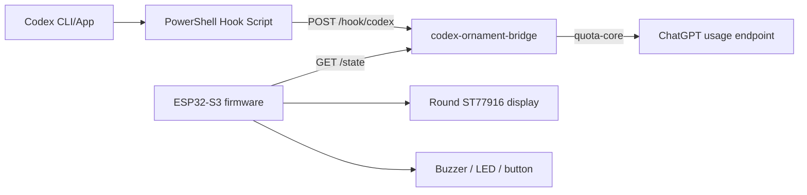

# Architecture Design

## Components

## PC Bridge

The bridge is a small Rust HTTP service. It owns:

- HTTP endpoints for ESP32 and hook scripts.
- In-memory latest task event.
- Cached-or-refresh quota reads through `quota-core`.
- Basic LAN write protection.

## Hook Script

`scripts/codex-ornament-hook.ps1` adapts two Codex input styles:

- `notify`: JSON arrives as the first command-line argument.
- lifecycle hook: JSON arrives on stdin.

The script posts the raw JSON to the bridge and returns a JSON response that allows Codex to continue.

## ESP32 Firmware

The firmware is split into modules:

- `wifi`: station connection and retry.
- `bridge_client`: HTTP GET and JSON parse.
- `ornament_state`: typed runtime state.
- `display`: screen rendering boundary.
- `app_main`: task orchestration.

Display code is currently a stub because the physical display pinout and SPI/QSPI mode must be verified first.
